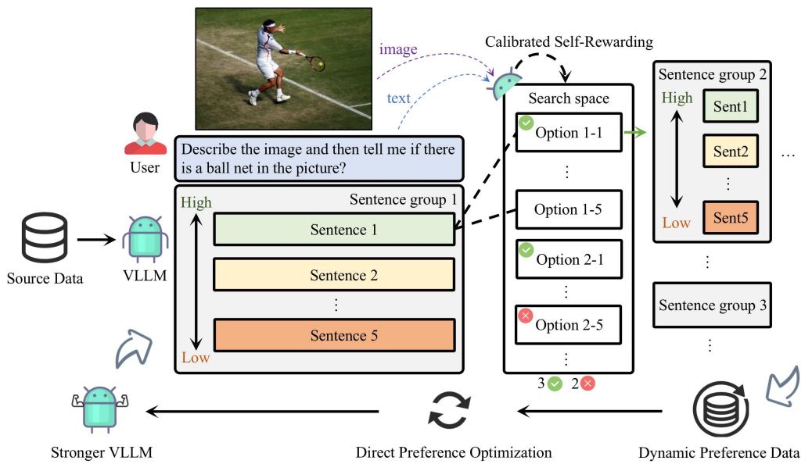

* I’m **Dongjie Cheng(程东杰)**, a senior student at Sichuan University. As the top-ranked student in my grade majoring in Artificial Intelligence last year, I was honored with the **2023 China National Scholarship** for my academic excellence. 
* My research interests lie in emerging areas such as **large vision-language models (LVLM) fine-tuning and alignment**, **AI for medical sciences**, **multimodal content generation and evaluation**. I also always maintain an open mind and am willing to learn new things.
* I used to serve as a research assistant in **Dr. Kang Li**'s Lab at the **West China Hospital – Big Data Center**, where my contributions span several projects, including the evaluation and improvement of the Segment Anything Model (SAM), and exploring evaluation methods for T2i (text-to-image) generation. I am also doing a remote internship at **Dr. Huaxiu Yao**'s Lab, mainly exploring the fine-tuning, alignment, and hallucination mitigation of large multimodal models. Up to now, I have mainly been responsible for and participated in four publications, two of which have been accepted by **NeurIPS-2024** and **BDMA(IF=7.7)**, three of which have been made available on arXiv. 

# 🔥 News
- *2024.10*: &nbsp;🎉🎉 Thanks to all collaborators and mentors, my Google Scholar citations have now reached 100.
- *2024.09*: &nbsp;🎉🎉 [***CSR***](https://arxiv.org/pdf/2405.14622) was accepted by **NeurIPS 2024**
- *2024.08*: &nbsp;🎉🎉 [***TV-SAM***](https://arxiv.org/pdf/2402.15759) was accepted by **Big Data Mining and Analytics** (JCR Q1, 中科院1区, IF=7.7)
- *2024.07*: &nbsp;🎉🎉 [The short version of ***CSR***](https://openreview.net/forum?id=B7sj10tXbL) was presented in  **ICML 2024 FM-Wild Workshop**

# 📖 Education
* B.S. in Artificial Intelligence, **Sichuan University**, Senior Year 
* GPA (Compulsory): **3.89/4**, **91.74/100**
* GPA (Overall): **3.78/4**, **90.1/100**
* Rank: **4/48**
* IELTS: **7.0** *(minimum sub-score 6.5)*
* CET-6: **636**

# 🎖 Honors & Awards
* 

National Scholarship (1/48 that year)

2023.11

* 

National Third Prize, “China Software Cup - Finals”

2023.08

* 

Second Prize, “RoboMaster - North Region Competition”

2023.06

* 

Second Prize, “National College Mathematics Competition”

2021.12

# 📝 Research Publication

- ***Calibrated self-rewarding vision language models***

<em>Co-First Author, Accepted, NeurIPS-2024</em>

<em>(The short version is presented in ICML 2024 FM-Wild Workshop)</em>

<em><a href="https://arxiv.org/pdf/2405.14622">Arxiv, abs/2405.14622</a></em>

- ***TV-SAM: Increasing Zero-Shot Segmentation Performance on Multimodal Medical Images Using GPT-4 Generated Descriptive Prompts Without Human Annotation***

<em>Co-First Author, Accepted, Big Data Mining and Analytics (JCR Q1, 中科院1区, IF=7.7)</em>

<em><a href="https://arxiv.org/pdf/2402.15759">ArXiv, abs/2402.15759</a></em>

- ***SAM on Medical Images: A Comprehensive Study on Three Prompt Modes***

<em>Co-First Author, Cited by: 100</em>

<em><a href="https://arxiv.org/pdf/2305.00035">ArXiv, abs/2305.00035</a></em>

- ***Evaluating Hallucination in Text-to-Image Diffusion Models with Scene-Graph based Question-Answering Agent***

<em>Co-First Author, Submitting to NeurIPS-2024 D&B Track</em>

# 💻 Experience
## WEST CHINA HOSPITAL – BIG DATA CENTER
* Research Assitant of **Dr.Kang Li** ’s Lab
* February, 2023 - Present
* Supervisor: **Dr.Kang Li**, **Dr.Qicheng Lao**
  
## UNC-CHAPEL HILL
* Remote Intern of **Dr.Huaxiu Yao** ’s Lab
* March, 2024 - Present
* Supervisor: **Dr.Huaxiu Yao**

# 🧩 Projects
## 🎙 **VLM project**

  
  📝 ***[Calibrated Self-Rewarding Vision Language Models](https://arxiv.org/pdf/2405.14622)***
  
  🔗 [**Project**](https://dongjie-cheng.github.io/CSR.html)
- Our work addresses misalignment challenges in LVLMs by proposing the Calibrated Self-Rewarding (CSR) approach, which enables the model to self-improve by iteratively generating candidate responses, evaluating the reward for each response, and curating preference data for fine-tuning. In the reward modeling, we employ a step-wise strategy and incorporate visual constraints into the self-rewarding process to place greater emphasis on visual input. Empirical results demonstrate that CSR enhances performance and reduces hallucinations across ten benchmarks and tasks, achieving substantial improvements over existing methods by 7.62%. Our empirical results are further supported by rigorous theoretical analysis, under mild assumptions, verifying the effectiveness of introducing visual constraints into the self-rewarding paradigm.
- I was responsible for the specific implementation and optimization of the CSR method, as well as core tasks such as DPO training and SFT training for VLM.

## 👨‍⚕️ **SAM project**

  
  📝 ***[SAM on Medical Images: A Comprehensive Study on Three Prompt Modes.](https://arxiv.org/pdf/2305.00035)***
  
  📝 ***[TV-SAM: Increasing Zero-Shot Segmentation Performance on Multimodal Medical Images Using GPT-4 Generated Descriptive Prompts Without Human Annotation](https://arxiv.org/pdf/2402.15759)***
  
  🔗 [**Project**](https://github.com/JZK00/TV-SAM)
- In the SAM project, We proposed using large models to generate descriptions for segmentation targets, feeding theses descriptions to the detection model to produce bounding boxes for SAM, thereby achieving zero-shot segmentation. 
- I was responsible for conceiving and implementing specific experiments. Firstly, I completed the evaluation of the SAM model on multiple modalities medical datasets. Then I verified the effectiveness of the improvement method driven by LLM (Large Language Models). 
- The results show that the improved method performs well under zero-shot conditions, outperforming the Grounded-SAM baseline on most datasets. The project ultimately resulted in two papers, of which I am a co-first author. 

## 📏 **T2i-Eval project**

  📝 ***Evaluating Hallucination in Text-to-Image Diffusion Models with Scene-Graph based Question-Answering Agent***
  
- In the T2i-Eval project, we proposed a method combining Scene Graph and Graph QA to score the quality of generated images, conducting a comprehensive evaluation of images from perspectives such as object omission, attribute inaccuracies, relational errors, and hallucinations.
- I was responsible for generating evaluation dataset images, the specific design and experimentation of the Scene Graph part, achieving the construction of Scene Graphs through the use of GroundingDINO+BLIP VQA.
- We constructed a human-evaluated dataset containing 12,000 images from 1,000 prompts and validated the effectiveness of our method. Compared with human evaluations, our Pearson and Kendall correlation coefficients surpassed those of T2ICompbench(Neurips 2023). This project ultimately resulted in one paper, for which I am a co-first author.

# 🔭 Interests
- 🎹 Piano (Amateur Level 10, Issued by Shanghai Conservatory of Music)
- ✏️ Sketch & Quick Sketch (Amateur Level 4&6)
- 🌄 Hiking
- ⚽ Football (I'm a big fan of BVB.) 
- 🕹️ Games (Valorant, RainbowSix...)

# 🌏 Visitor Map

